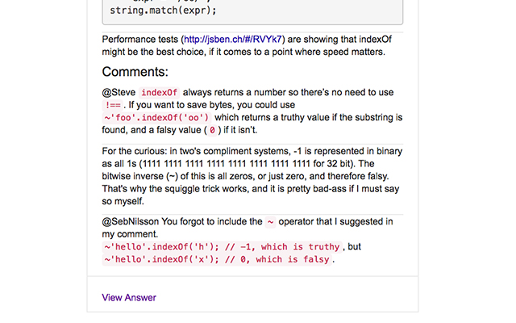
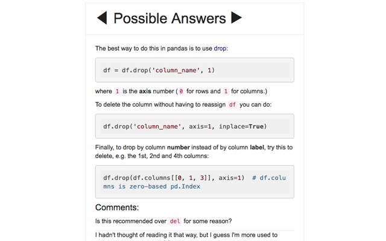
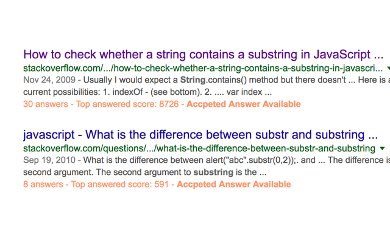

# Stack Search

Stack Search is a chrome extension that add to your google search related to stackoverflow and stackexchange the information about how many answers available, the max top answer score and if there is an accepted answer for this question.  

What's new in version 1.4.3
1. refactor
2. fix issue #6
3. fix issue #5
4. fix issue #2

What's new in version 1.4.2
1. popup issue

What's new in version 1.4.1
1. report a bug
2. donate -- help me so i can imrpove this extension

What's new in version 1.4.0
1. add new domains:
	- serverfault
	- askubuntu
	- superuser

What's new in version 1.3.7
1. hot fix

What's new in version 1.3.6
1. add "out of" numbers to possible answers ( you are at answer 1 out of 3)
2. fix issues 
3. fix empty title mode

What's new in version 1.3.5
1. highlight code blocks

What's new in version 1.3.4
1. bug fix

What's new in version 1.3.3
1. fix gmail issue
2. fix docs issue

What's new in version 1.3.2
1. remove arrows when is only a single answer
2. css improvemnts

What's new in version 1.3.1
1. css issue #1

What's new in version 1.3.0
1. add information for  all sub domains of stackexchange.com 
2. fix local problem (rtl and heberew problems)
3. fix bugs

What's new in version 1.2.5:
1. fix issues
2. improve css for code block. 

What's new in version 1.2.4:
1. carousel with all top rated answers.
2. improve css for code block. 

Stack Search was created by [Dor Amir](amirdor@gmail.com)
### Version
1.4.3

### Installation
Via Chrome browser, click on the link below

[Chrome extension store]( https://chrome.google.com/webstore/detail/stack-search/mmbkjfdlhegphofeodeinpbcifaobacl?utm_source=github&utm_medium=readme)

Then, click on **"ADD TO CHROME"**

### Getting started
Search on Google, if the results will include any questions on stackoverflow you will get the enricment that **Stack Search** will give. 

### Results

License
----

**Free Software, Hell Yeah!**
